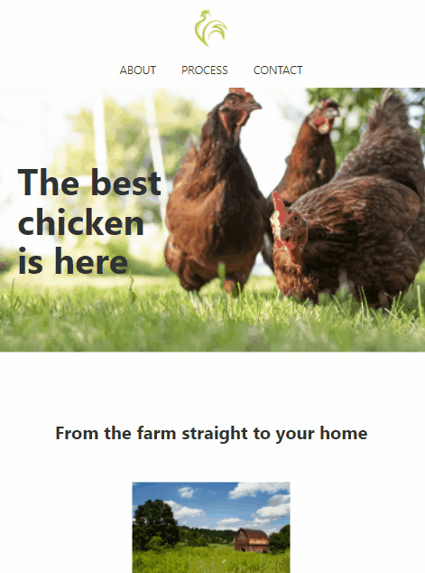

# Chicken Farm Website
Simple responsive website created with HTML and CSS.

## Objective
This project was created for learning purposes and to demonstrate my abilities with HTML and CSS. It is super simple since it is my first time "flying solo" and I just wanted to put something out here in github as soon as possible. Thought it is simple, it was made with care and I hope you will enjoy it.

## Tecnologies Used
* HTML
* CSS

## What I learned
What I am most proud about this project is that it was throught it that I learned how to position a fixed menu. Also I am happy for finally putting myself out there and doing a project on my own.

## Visit The Website
[Chicken Farm Website](https://chicken-farm.vercel.app/)

## Demos

### Demo Website

---

### Demo Website Ipad

---

### Demo Website Iphone

